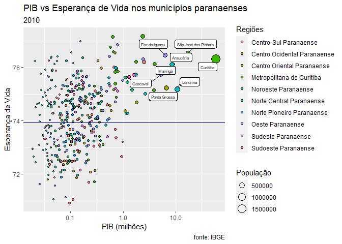
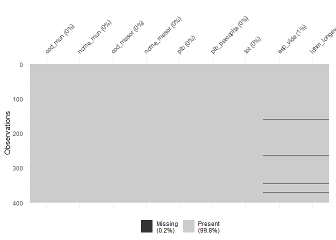
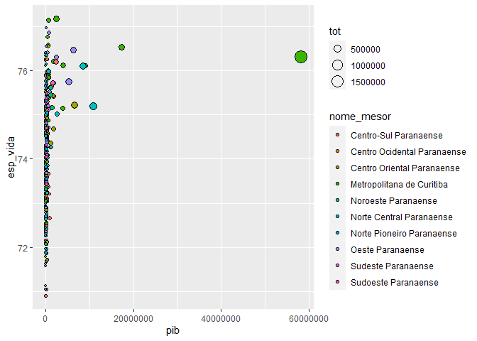
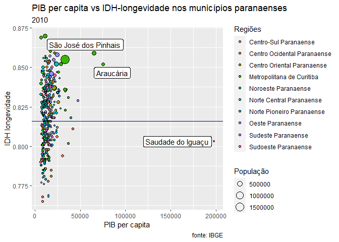
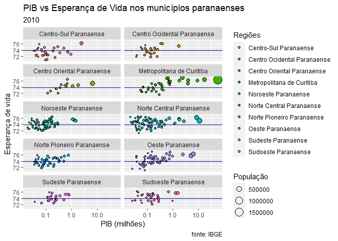
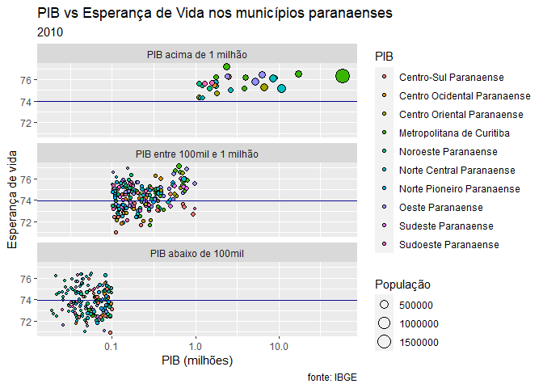

Longevidade nos municípios do PR
================
Marcos Abreu

## Um exercício de “data wrangling”

Um dos meus livros prediletos sobre R é o
[ModernDive](https://moderndive.com). É muito agradável de ler, e a
estrutura de tópicos me parecer ser a melhor forma já proposta para
apresentar os diversos temas cobertos pelo livro.

Logo no início nos deparamos com uma ótima introdução sobre tipos de
gráficos e com o belo gráfico da
[figura 2.1](https://moderndive.com/2-viz.html#fig:gapminder) que mostra
a relação entre PIB e esperança de vida entre países.

Este exercício se propõe a repetir o mesmo gráfico, porém para os
municípios do Paraná, usando as regiões para o código de cores, que
termine parecido como isto:



## Fontes de dados

O primeiro desafio do exercício foi obter os dados necessários para o
gráfico. São eles:

  - Relação de municípios por regiões do estado;

  - PIB dos municípios;

  - População dos municípios;

  - Esperança de vida nos municípios.

### PIB dos Municípios (IBGE)

O portal [Cidades@](https://cidades.ibge.gov.br/pesquisas) possui
diversas pesquisas realizadas pelo IBGE com dados das cidades
brasileiras. Neste portal é possível encontrar [link para o levantamento
do PIB dos
municípios](https://www.ibge.gov.br/estatisticas/economicas/contas-nacionais/2036-np-produto-interno-bruto-dos-municipios/9088-produto-interno-bruto-dos-municipios.html?=&t=o-que-e).

No menu “Edições -\> 2018 -\> Tabelas” é possível baixar arquivo com a
base de dados 2010 a 2018.

Estes dados nos fornecem o primeiro e o segundo itens da lista do que
precisamos.

``` r
pib <- readxl::read_excel("./dados/PIB dos Municípios - base de dados 2010-2018.xls",
                          sheet = 1)
```

Os dados são para todos os municípios do Brasil e os nomes das colunas
são mais adequados para leitura humana do que para manipulação de
dados. Vamos filtrar apenas os municípios que nos interessa e ajustar os
nomes das colunas. Também vamos reduzir as colunas apenas àquelas que
precisamos.

``` r
pib <- pib %>% 
  filter(`Sigla da Unidade da Federação` == "PR",
         `Ano` == 2010) %>% 
  select(`Código do Município`,
         `Nome do Município`,
         `Código da Mesorregião`,
         `Nome da Mesorregião`,
         `Produto Interno Bruto, \na preços correntes\n(R$ 1.000)`,
         `Produto Interno Bruto per capita, \na preços correntes\n(R$ 1,00)`) %>% 
  rename(cod_mun = `Código do Município`,
         nome_mun = `Nome do Município`,
         cod_mesor = `Código da Mesorregião`,
         nome_mesor = `Nome da Mesorregião`,
         pib = `Produto Interno Bruto, \na preços correntes\n(R$ 1.000)`,
         pib_percapita = `Produto Interno Bruto per capita, \na preços correntes\n(R$ 1,00)`)

# Vamos ajustar os tipos de algumas colunas para facilitar juntar com outras tabelas
pib <-  pib %>% 
  mutate (cod_mun = as.character(cod_mun),
          cod_mesor = as.character(cod_mesor),
          nome_mesor = as.character(nome_mesor))
```

Importante notar que nesta base, o Paraná possui (corretamente) 399
municípios.

### Censo 2010 - População dos Municípios (IBGE)

O IBGE também disponibiliza os dados do Censo de 2010 no link
[Estatísticas](https://www.ibge.gov.br/estatisticas/downloads-estatisticas.html).

Neste caso eu selecione “Censo -\> Censo\_Demografico\_2010 -\>
resultados e baixei o arquivo”total\_populacao\_parana.zip", que contém
dentro dele um Excel com os dados por município.

Vamos ler este arquivo:

``` r
pop <- readxl::read_excel("./dados/total_populacao_parana.xls",
                          sheet = 1)
```

Os dados são bastante intuitivos e vamos ficar apenas com as colunas que
nos serão úteis.

``` r
pop <- pop %>% 
  rename(cod_mun = `Código do município`,
         nome_mun = `Nome do município`,
         tot = `Total da população 2010`) %>% 
  select(cod_mun, nome_mun, tot)
glimpse(pop)
```

    ## Rows: 401
    ## Columns: 3
    ## $ cod_mun  <chr> "4100103", "4100202", "4100301", "4100400", "4100459", "41...
    ## $ nome_mun <chr> "Abatiá", "Adrianópolis", "Agudos do Sul", "Almirante Tama...
    ## $ tot      <dbl> 7753, 6374, 8270, 103245, 4306, 3206, 13662, 10179, 20516,...

``` r
head(pop)
```

    ## # A tibble: 6 x 3
    ##   cod_mun nome_mun               tot
    ##   <chr>   <chr>                <dbl>
    ## 1 4100103 Abatiá                7753
    ## 2 4100202 Adrianópolis          6374
    ## 3 4100301 Agudos do Sul         8270
    ## 4 4100400 Almirante Tamandaré 103245
    ## 5 4100459 Altamira do Paraná    4306
    ## 6 4128625 Alto Paraíso          3206

``` r
tail(pop)
```

    ## # A tibble: 6 x 3
    ##   cod_mun                                nome_mun            tot
    ##   <chr>                                  <chr>             <dbl>
    ## 1 4128658                                Virmond            3950
    ## 2 4128708                                Vitorino           6509
    ## 3 4128500                                Wenceslau Braz    19294
    ## 4 4128807                                Xambrê             6011
    ## 5 Total                                  Paraná         10439601
    ## 6 Fonte: IBGE, Resultados do Censo 2010. <NA>                 NA

Precisamos excluir as 2 últimas linhas para não atrapalharem.

``` r
pop <- pop %>% 
  filter(!is.na(tot)) %>% # Exclui linha da fonte 
  filter(!(cod_mun == "Total")) # Excluir linha total
```

Esta base também apresenta 399 municípios para o Paraná.

### Esperança de vida nos municípios do PR

Esta foi a informação que tive mais dificuldade para encontrar. No
final, acabei optanto pelos dados do site
[atlas.brasil.org](https://atlas.brasil.org). Para conseguir os dados é
preciso navegar no site pela área de “Consulta” e “Ver na tabela”. Os
dados podem ser filtrados pela territorialidade: Municípios -\> por
Estado -\> Paraná -\> Todos os municípios. E dentro da opção de
“Desenvolvimento Humano”, a opção “Logenvidade” possui 2 fontes: PNAD
(2012-2017) e Censo (1991-2010). Ainda é preciso selecionar opções no
painel direito, onde consta “desagregações para todas as linhas”.

Infelizmente, quando da minha consulta, os dados do PNAD estavam
disponíveis apenas por estado e não por município. Por causa disto a
única opção foi escolher os dados do Censo de 2010.

O sistema permite o download de um arquivo “data.xlsx”. Para ler este
arquivo optei por *readxl::read\_excel* e por renomear as colunas para
diminuir os nomes.

``` r
esp_vida_pr_2010 = readxl::read_excel("./dados/data.xlsx",
                             sheet = 1)
esp_vida_pr_2010 <- esp_vida_pr_2010 %>% 
  rename(nome_mun = Territorialidades,
         esp_vida = `Esperança de vida ao nascer 2010`,
         idhm_longev = `IDHM Longevidade 2010`)
glimpse(esp_vida_pr_2010)
```

    ## Rows: 402
    ## Columns: 3
    ## $ nome_mun    <chr> "Brasil", "Abatiá (PR)", "Adrianópolis (PR)", "Agudos d...
    ## $ esp_vida    <dbl> 73.94, 73.23, 74.02, 72.41, 75.39, 71.79, 75.88, 74.74,...
    ## $ idhm_longev <dbl> 0.816, 0.804, 0.817, 0.790, 0.840, 0.780, 0.848, 0.829,...

``` r
head(esp_vida_pr_2010)
```

    ## # A tibble: 6 x 3
    ##   nome_mun                 esp_vida idhm_longev
    ##   <chr>                       <dbl>       <dbl>
    ## 1 Brasil                       73.9       0.816
    ## 2 Abatiá (PR)                  73.2       0.804
    ## 3 Adrianópolis (PR)            74.0       0.817
    ## 4 Agudos do Sul (PR)           72.4       0.79 
    ## 5 Almirante Tamandaré (PR)     75.4       0.84 
    ## 6 Altamira do Paraná (PR)      71.8       0.78

``` r
tail(esp_vida_pr_2010)
```

    ## # A tibble: 6 x 3
    ##   nome_mun                                                  esp_vida idhm_longev
    ##   <chr>                                                        <dbl>       <dbl>
    ## 1 Vitorino (PR)                                                 74.0       0.818
    ## 2 Wenceslau Braz (PR)                                           72.4       0.79 
    ## 3 Xambrê (PR)                                                   74.5       0.825
    ## 4 <NA>                                                          NA        NA    
    ## 5 Elaboração: Atlas do Desenvolvimento Humano no Brasil. P~     NA        NA    
    ## 6 Fontes: dados do IBGE e de registros administrativos, co~     NA        NA

Dois ajustes são necessários para estes dados:

1.  Algumas linhas precisam ser eliminadas.

A primeira linha contém os dados do Brasil - como uma referência - e
precisa ser retirada dos dados. Mas, vamos guardá-la para utilizá-la
mais tarde.

``` r
ref_br <- esp_vida_pr_2010 %>% 
  filter(nome_mun == "Brasil")
esp_vida_pr_2010 <- esp_vida_pr_2010 %>% 
  filter(!(nome_mun == "Brasil"))
```

No final dos dados há algumas linhas com informações que não são dados:
a elaboração e a fonte. Podemos excluir também estas linhas - incluindo
uma linha em branco entre o último município e estas 2 linhas finais -
fazendo um filtro pelas colunas de dados.

``` r
esp_vida_pr_2010 <- esp_vida_pr_2010 %>% 
  filter(!is.na(idhm_longev))
```

2.  Os nomes dos municípios estão acompanhados da sigla do estado.
    Queremos retirar esta sigla, ou seja, ao invés de “Ibaiti (PR)”
    queremos apenas “Ibaiti”.

Podemos fazer isto através do pacote *stringr*. A função *str\_sub()*
estrai uma substring que no nosso caso se inicía sempre no primeiro
caracter e termina no quinto caracter de trás para frente (repare no
símbolo “-” indicando a contagem de trás para frente).

``` r
esp_vida_pr_2010 <- esp_vida_pr_2010 %>% 
  mutate(nome_mun = str_trim(str_sub(nome_mun, 1, -5), "both"))
```

Lembrando que nesta base os nomes dos municípios estão escritos num
formato semelhante ao obtido pela função *str\_to\_title()* do pacote
*stringr*.

Nesta base há 398 municípios, um a menos que o esperado.

## Juntando os dados

As bases possuem colunas que nos ajudam a juntar as bases principalmente
o código IBGE dos municípios e os nomes. Importante que nas 3 bases os
nomes estão no mesmo padrão de grafia.

``` r
dados_pr <- pib %>% left_join(pop)
```

    ## Joining, by = c("cod_mun", "nome_mun")

``` r
dados_pr <- dados_pr %>% left_join(esp_vida_pr_2010)
```

    ## Joining, by = "nome_mun"

O pacote *visdat* é ótimo para ajudar na visualização de dados
faltantes.

``` r
library(visdat)
dados_pr %>% vis_dat()
```

<!-- -->

``` r
dados_pr %>% vis_miss()
```

<!-- -->

## Diagrama de Dispersão

Vamos fazer um diagram de dispersão semelhante ao da figura 2.1 do livro
ModernDive, porém, neste caso, estamos cruzando o PIB dos municípios
paranenses com a esperança de vida, os pontos serão dimensionados pela
população e coloridos conforme a região (para isto precisamos
transformar os dados de região em fatores).

``` r
dados_pr <- dados_pr %>% 
  mutate(nome_mesor = as.factor(nome_mesor))
```

``` r
options(scipen = 999) # desabilita a notação científica
pr_plot <- 
  ggplot(data = (dados_pr %>% filter(!is.na(esp_vida)))) +
   geom_point(mapping = aes(x = pib, 
                            y = esp_vida, 
                            size = tot, 
                            fill = nome_mesor), shape = 21)
pr_plot
```

<!-- -->

Não ficou bom. Vamos mudar a escala de x para logarítmica para melhor
visualização dos dados. Vamos também ajustar os nomes dos eixos e das
legendas. E, vamos incluir uma linha com a média de esperança de vida do
Brasil.

``` r
 # desabilita a notação científica
pr_plot <- 
  ggplot(data = (dados_pr %>% filter(!is.na(esp_vida)))) +
  geom_point(mapping = aes(x = pib/1000000, 
                            y = esp_vida, 
                            size = tot, 
                            fill = nome_mesor), shape = 21) +
  labs(title = "PIB vs Esperança de Vida nos municípios paranaenses",
       subtitle = "2010",
       caption = "fonte: IBGE",
       x = "PIB (milhões)",
       y = "Esperança de Vida",
       fill = "Regiões",
       size = "População") +
  scale_x_continuous(trans = 'log10') +
  ggrepel::geom_label_repel(data = (dados_pr %>% filter(!is.na(esp_vida), pib > 5000000)), mapping = aes(x = pib/1000000, 
                            y = esp_vida, 
                            label = nome_mun), 
                            size = 2,
                            max.overlaps = Inf) +
  geom_hline(data = ref_br, aes(yintercept = esp_vida), color = "darkblue") 
#+
 # geom_label(aes(x = pib, y = 73, label = "Esp. Vida média - Brasil"), size = 2)

pr_plot
```

<!-- -->

Alternativamente podemos trocar a esperança de vida pelo Índice de
Desenvolvimento Humano de longevidade, e o PIB por PIB per capita.

``` r
 # desabilita a notação científica
pr_plot <- 
  ggplot(data = (dados_pr %>% filter(!is.na(esp_vida)))) +
  geom_point(mapping = aes(x = pib_percapita, 
                            y = idhm_longev, 
                            size = tot, 
                            fill = nome_mesor), shape = 21) +
  labs(title = "PIB per capita vs IDH-longevidade nos municípios paranaenses",
       subtitle = "2010",
       caption = "fonte: IBGE",
       x = "PIB per capita",
       y = "IDH longevidade",
       fill = "Regiões",
       size = "População") +
  geom_hline(data = ref_br, aes(yintercept = idhm_longev), color = "darkblue") +
  ggrepel::geom_label_repel(data = (dados_pr %>%
                                      filter(!is.na(esp_vida),
                                             pib_percapita > 50000)),
                            mapping = aes( x = pib_percapita, 
                                           y = idhm_longev, 
                                           label = nome_mun),
                            max.overlaps = Inf) 
pr_plot
```

<!-- -->

Alguns municípios aparentam ter um PIB per capita acima da média
estadual, em função de atividades econômicas específicas de suas
regiões. Para São José dos Pinhais e Araucária a indústria de
transformação (automotiva e ciderurgia, respectivamente), e para Saudade
do Iguaçu, energia elétrica.

### Facets

Uma visão de facetas ajuda a separar as regiões do estado.

``` r
pr_plot <- 
  ggplot(data = (dados_pr %>% filter(!is.na(esp_vida)))) +
  geom_point(mapping = aes(x = pib/1000000, 
                            y = esp_vida, 
                            size = tot, 
                            fill = nome_mesor), shape = 21) +
  labs(title = "PIB vs Esperança de Vida nos municípios paranaenses",
       subtitle = "2010",
       caption = "fonte: IBGE",
       x = "PIB (milhões)",
       y = "Esperança de vida",
       fill = "Regiões",
       size = "População") +
  scale_x_continuous(trans = 'log10') +
  geom_hline(data = ref_br, aes(yintercept = esp_vida), color = "darkblue") 

pr_plot + facet_wrap(~ nome_mesor, ncol = 2)
```

<!-- -->

Outra opção seria agrupar os municípios não por região mas por faixa do
PIB. Para isso precisamos criar uma nova variável, conforme mostrado a
seguir.

``` r
dados_pr <- dados_pr %>% 
  mutate(grupo_pib = case_when(pib > 1000000 ~ "PIB acima de 1 milhão",
                               pib <= 1000000 & pib > 100000 ~ "PIB entre 100mil e 1 milhão",
                               pib <= 100000 ~ "PIB abaixo de 100mil"),
         grupo_pib = ordered(as.factor(grupo_pib), levels = c("PIB abaixo de 100mil", "PIB entre 100mil e 1 milhão", "PIB acima de 1 milhão")))

pr_plot <- 
  ggplot(data = (dados_pr %>% filter(!is.na(esp_vida)))) +
  geom_point(mapping = aes(x = pib/1000000, 
                            y = esp_vida, 
                            size = tot, 
                            fill = nome_mesor), shape = 21) +
  labs(title = "PIB vs Esperança de Vida nos municípios paranaenses",
       subtitle = "2010",
       caption = "fonte: IBGE",
       x = "PIB (milhões)",
       y = "Esperança de vida",
       fill = "PIB",
       size = "População") +
  scale_x_continuous(trans = 'log10') +
  geom_hline(data = ref_br, aes(yintercept = esp_vida), color = "darkblue") 

pr_plot + facet_wrap(~ grupo_pib, ncol = 1)
```

<!-- -->

## Conclusões

Este exercício foi construído para exemplificar ações de ajuste de
dados, análise exploratória e construção de gráficos.
